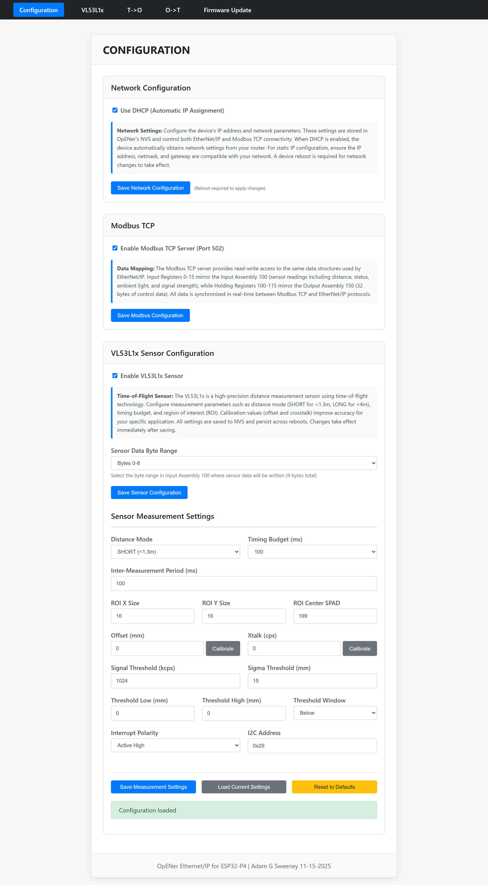
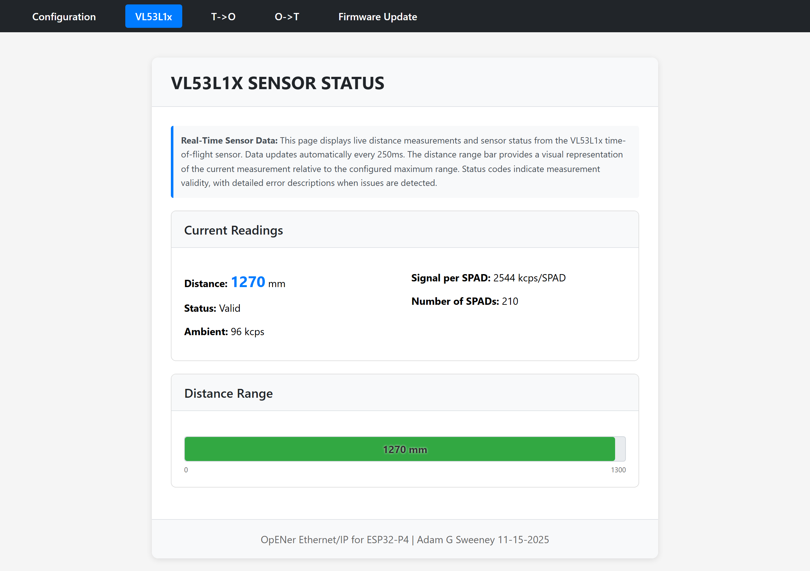
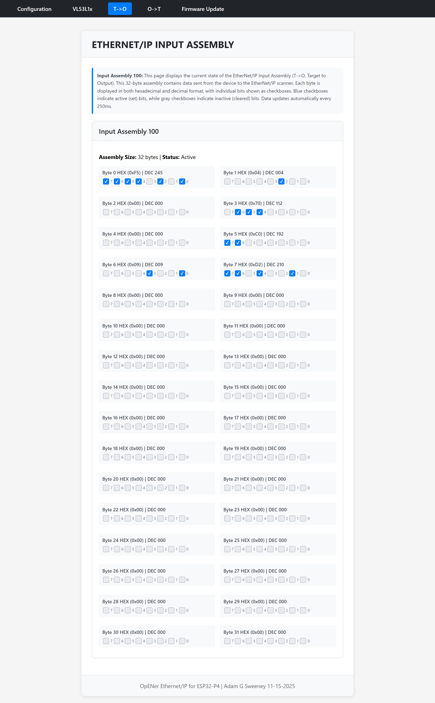
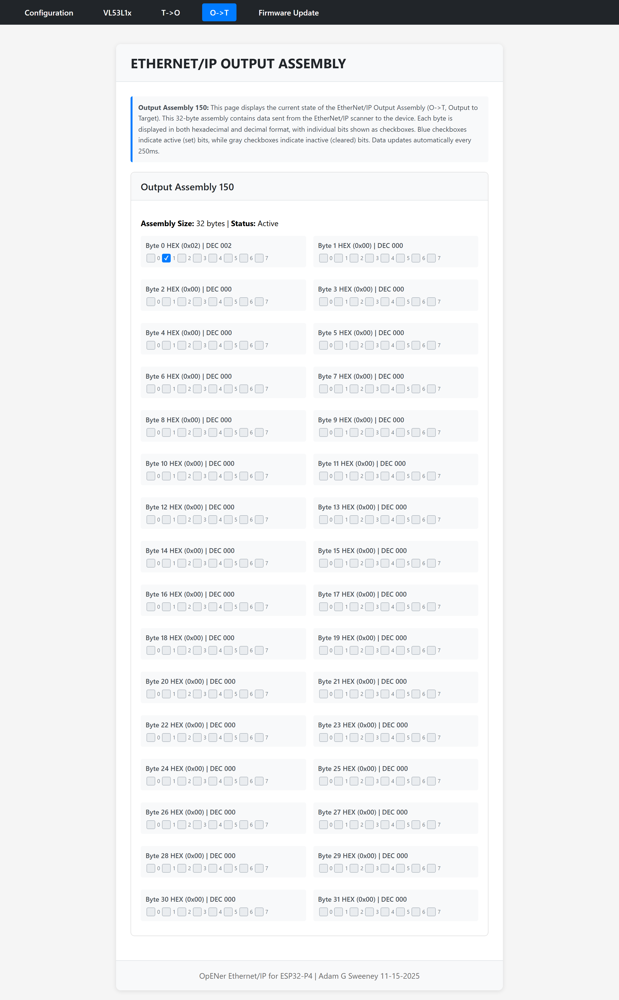
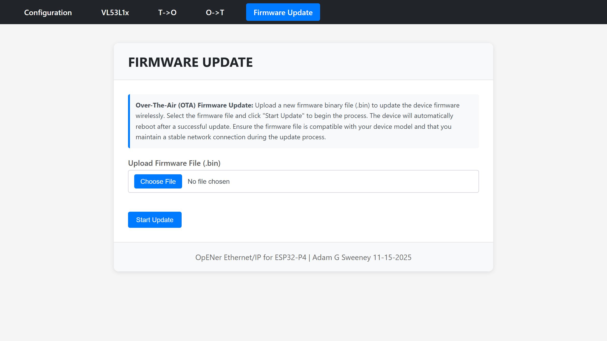

# Web UI User Guide

A comprehensive guide to using the ESP32-P4 OpENer EtherNet/IP adapter web interface.

## Overview

The Web UI provides a modern, browser-based interface for configuring and monitoring your ESP32-P4 OpENer EtherNet/IP adapter. Accessible via HTTP on port 80, the interface offers complete device configuration, real-time sensor monitoring, EtherNet/IP assembly visualization, and over-the-air firmware updates.

### Key Features

- **Network Configuration**: Configure DHCP/Static IP, netmask, gateway, and DNS settings
- **VL53L1x Sensor Configuration**: Full sensor parameter configuration with calibration support
- **Real-time Sensor Monitoring**: Live distance readings with visual bar chart
- **EtherNet/IP Assembly Monitoring**: Bit-level visualization of Input and Output assemblies
- **Modbus TCP Configuration**: Enable/disable Modbus TCP server
- **OTA Firmware Updates**: Upload and install firmware updates via web interface
- **Responsive Design**: Works on desktop and mobile devices
- **No External Dependencies**: All CSS and JavaScript is self-contained (no CDN required)

## Accessing the Web UI

1. **Find your device's IP address**:
   - If using DHCP, check your router's DHCP client list
   - If using static IP, use the configured address
   - The device may also display its IP address via serial console

2. **Open a web browser** and navigate to:
   ```
   http://<device_ip>
   ```
   Example: `http://192.168.1.100`

3. **Navigation**: Use the top navigation bar to switch between pages:
   - **Configuration** - Device settings and configuration
   - **VL53L1x** - Sensor status and monitoring (only visible when sensor is enabled)
   - **T->O** - Input Assembly (Target to Originator) monitoring
   - **O->T** - Output Assembly (Originator to Target) monitoring
   - **Firmware Update** - Over-the-air firmware updates

---

## Configuration Page



The Configuration page (`/`) is the main interface for configuring all device settings. It is organized into three main cards:

### Network Configuration Card

Configure the device's network settings, including IP address assignment method and network parameters.

**DHCP Mode (Recommended for most networks)**:
- Check "Use DHCP" to enable automatic IP assignment
- The device will obtain IP address, netmask, gateway, and DNS from your router
- DNS configuration fields are hidden when DHCP is enabled

**Static IP Mode**:
- Uncheck "Use DHCP" to configure static network settings
- **IP Address**: The device's IP address (e.g., `192.168.1.100`)
- **Netmask**: Subnet mask (e.g., `255.255.255.0`)
- **Gateway**: Default gateway/router IP address (e.g., `192.168.1.1`)
- **Primary DNS**: Primary DNS server (e.g., `8.8.8.8`)
- **Secondary DNS**: Secondary DNS server (e.g., `8.8.4.4`)

**Important Notes**:
- All network settings are stored in OpENer's NVS (Non-Volatile Storage)
- Network changes require a device reboot to take effect
- These settings control both EtherNet/IP and Modbus TCP connectivity
- Ensure static IP settings are compatible with your network configuration

**To save**: Click "Save Network Configuration" and reboot the device.

### Modbus TCP Card

Enable or disable the Modbus TCP server functionality.

**Configuration**:
- **Enable Modbus TCP Server**: Check to enable Modbus TCP on port 502
- Settings persist across reboots

**Data Mapping**:
The Modbus TCP server provides read-write access to the same data structures used by EtherNet/IP:
- **Input Registers 0-15**: Mirror Input Assembly 100 (sensor readings including distance, status, ambient light, and signal strength)
- **Holding Registers 100-115**: Mirror Output Assembly 150 (32 bytes of control data)
- All data is synchronized in real-time between Modbus TCP and EtherNet/IP protocols

**To save**: Click "Save Modbus Configuration".

### VL53L1x Sensor Configuration Card

Configure the VL53L1x time-of-flight distance sensor parameters.

**Sensor Enable/Disable**:
- **Enable VL53L1x Sensor**: Check to enable the sensor
- When disabled, sensor data bytes in Input Assembly 100 are set to zero
- The VL53L1x navigation menu item is hidden when the sensor is disabled

**Sensor Data Byte Range**:
Select where sensor data will be written in Input Assembly 100:
- **Bytes 0-8**: Default location (9 bytes total)
- **Bytes 9-17**: Alternative location
- **Bytes 18-26**: Alternative location

**Sensor Measurement Settings**:

1. **Distance Mode**:
   - **SHORT (<1.3m)**: Optimized for short-range measurements
   - **LONG (<4m)**: Optimized for long-range measurements

2. **Timing Budget (ms)**: Measurement time per sample
   - Options: 15, 20, 33, 50, 100, 200, 500 ms
   - Longer timing budgets improve accuracy but reduce update rate

3. **Inter-Measurement Period (ms)**: Time between measurements
   - Minimum: 15 ms
   - Must be ≥ timing budget

4. **ROI (Region of Interest) Settings**:
   - **ROI X Size**: Horizontal size (4-16 SPADs)
   - **ROI Y Size**: Vertical size (4-16 SPADs)
   - **ROI Center SPAD**: Center position (0-199)

5. **Calibration**:
   - **Offset (mm)**: Distance offset calibration (-128 to 127 mm)
     - Click "Calibrate" to perform offset calibration at a known target distance (recommended: 100mm)
   - **Xtalk (cps)**: Crosstalk calibration (0-65535 cps)
     - Click "Calibrate" to perform crosstalk calibration at a known target distance (recommended: 600mm)

6. **Thresholds**:
   - **Signal Threshold (kcps)**: Minimum signal strength (0-65535 kcps)
   - **Sigma Threshold (mm)**: Maximum measurement uncertainty (0-65535 mm)

7. **Threshold Window**:
   - **Threshold Low (mm)**: Lower distance threshold (0-4000 mm)
   - **Threshold High (mm)**: Upper distance threshold (0-4000 mm)
   - **Threshold Window**: Detection mode
     - **Below**: Detect targets below low threshold
     - **Above**: Detect targets above high threshold
     - **Out**: Detect targets outside the range
     - **In**: Detect targets inside the range

8. **Interrupt Polarity**:
   - **Active Low**: Interrupt signal is low when active
   - **Active High**: Interrupt signal is high when active

9. **I2C Address**: Sensor I2C address (default: `0x29`)

**Actions**:
- **Save Measurement Settings**: Save all sensor configuration parameters
- **Load Current Settings**: Reload current settings from device
- **Reset to Defaults**: Reset all settings to factory defaults

**Important Notes**:
- All sensor settings are saved to NVS and persist across reboots
- Changes take effect immediately after saving
- Calibration improves accuracy for your specific application environment
- After calibration, the sensor automatically restarts ranging

---

## VL53L1x Status Page



The VL53L1x Status page (`/vl53l1x`) provides real-time monitoring of sensor readings and visual distance representation.

**Note**: This page is only visible in the navigation menu when the sensor is enabled.

### Sensor Readings

Real-time display of current sensor measurements:

- **Distance**: Current distance measurement in millimeters (mm)
  - Range: 0-1300 mm (SHORT mode) or 0-4000 mm (LONG mode)
  - Value of 0 indicates no target detected

- **Status**: Range status code with human-readable description
  - **0**: No error (valid measurement)
  - **1**: Sigma failed (measurement uncertainty too high)
  - **2**: Signal failed (signal too weak)
  - **3**: Target out of range
  - **4**: Signal failed
  - **5**: Range valid but wrapped
  - **6**: Target out of range
  - **7**: Wrap-around (target beyond max range)

- **Ambient**: Ambient light level in kcps (kilo counts per second)

- **Signal per SPAD**: Signal strength per SPAD in kcps/SPAD

- **Number of SPADs**: Count of enabled SPADs (typically 16-64)

### Visual Distance Chart

A horizontal bar chart displaying the current distance measurement:

- **Dynamic Scaling**: 
  - 0-1300 mm scale for SHORT distance mode
  - 0-4000 mm scale for LONG distance mode
- **Gradient Color**: 
  - Red at minimum distance (0 mm)
  - Yellow at mid-range
  - Green at maximum distance
- **Smooth Transitions**: HSL color interpolation for smooth gradient
- **Square Corners**: Modern design with rounded corners
- **Auto-Update**: Refreshes every 250ms

### Error Status

Displays the current error status with:
- Error code in parentheses
- Human-readable description of the error condition

**Page Auto-Refresh**: The page automatically updates every 250ms to show the latest sensor readings.

---

## Input Assembly Page (T->O)



The Input Assembly page (`/inputassembly`) provides bit-level visualization of EtherNet/IP Input Assembly 100, which contains sensor data and other application data transmitted from the device (Target) to the PLC (Originator).

### Display Format

Each of the 32 bytes in Input Assembly 100 is displayed with:

- **Byte Number**: Byte index (0-31)
- **Hexadecimal Value**: `HEX (0xYY)` format
- **Decimal Value**: `DEC ZZZ` format
- **Individual Bits**: 8 checkboxes representing bits 0-7 (LSB to MSB)

### Bit Visualization

- **Read-Only**: Checkboxes are read-only (display only)
- **Visual Style**: 
  - Blue background when bit is set (1)
  - White checkmark when bit is active
  - Gray background when bit is clear (0)
- **Bit Order**: Bits are displayed from right to left (bit 0 = LSB, bit 7 = MSB)

### Sensor Data Location

By default, sensor data occupies bytes 0-8:
- **Bytes 0-1**: Distance (uint16_t, little-endian)
- **Byte 2**: Status code
- **Bytes 3-4**: Ambient light (uint16_t, little-endian)
- **Bytes 5-6**: Signal per SPAD (uint16_t, little-endian)
- **Bytes 7-8**: Number of SPADs (uint16_t, little-endian)

**Note**: The sensor data byte range can be configured on the Configuration page (bytes 0-8, 9-17, or 18-26).

**Page Auto-Refresh**: The page automatically updates every 250ms to show the latest assembly data.

---

## Output Assembly Page (O->T)



The Output Assembly page (`/outputassembly`) provides bit-level visualization of EtherNet/IP Output Assembly 150, which contains control data received from the PLC (Originator) and sent to the device (Target).

### Display Format

Each of the 32 bytes in Output Assembly 150 is displayed with:

- **Byte Number**: Byte index (0-31)
- **Hexadecimal Value**: `HEX (0xYY)` format
- **Decimal Value**: `DEC ZZZ` format
- **Individual Bits**: 8 checkboxes representing bits 0-7 (LSB to MSB)

### Bit Visualization

- **Read-Only**: Checkboxes are read-only (display only)
- **Visual Style**: 
  - Blue background when bit is set (1)
  - White checkmark when bit is active
  - Gray background when bit is clear (0)
- **Bit Order**: Bits are displayed from right to left (bit 0 = LSB, bit 7 = MSB)

### Data Usage

Output Assembly 150 contains 32 bytes of control data that can be used by your application. The specific usage depends on your application requirements.

**Page Auto-Refresh**: The page automatically updates every 250ms to show the latest assembly data.

---

## Firmware Update Page



The Firmware Update page (`/ota`) allows you to update the device firmware over-the-air (OTA) without physical access to the device.

### Updating Firmware

1. **Prepare Firmware Binary**:
   - Build your firmware using ESP-IDF build system
   - Locate the firmware binary file (typically `firmware.bin`)

2. **Upload Firmware**:
   - Click "Choose File" button
   - Select your firmware binary file
   - Click "Upload Firmware" button

3. **Update Process**:
   - The firmware is uploaded to the device
   - The device validates the firmware
   - Upon successful validation, the device reboots
   - The page automatically redirects to the Configuration page after a successful update

### Important Notes

- **Backup**: Ensure you have a working firmware version before updating
- **Network Connection**: Maintain network connectivity during the update process
- **Power**: Do not power off the device during firmware update
- **Validation**: The device validates the firmware before installation
- **Rollback**: If the update fails, the device may roll back to the previous firmware version (if rollback is enabled)

### Troubleshooting

- **Upload Fails**: Check file size and ensure it's a valid ESP32-P4 firmware binary
- **Update Fails**: Verify the firmware is compatible with your device hardware
- **Device Unresponsive**: Wait a few minutes for the device to reboot, then check the serial console for error messages

---

## REST API Reference

The Web UI uses a REST API for all data operations. All endpoints return JSON responses.

### Configuration Endpoints

#### `GET /api/config`
Retrieve current VL53L1x sensor configuration.

**Response**:
```json
{
  "distance_mode": 2,
  "timing_budget_ms": 100,
  "inter_measurement_ms": 100,
  "roi_x_size": 16,
  "roi_y_size": 16,
  "roi_center_spad": 199,
  "offset_mm": 0,
  "xtalk_cps": 0,
  "signal_threshold_kcps": 1024,
  "sigma_threshold_mm": 15,
  "threshold_low_mm": 0,
  "threshold_high_mm": 0,
  "threshold_window": 0,
  "interrupt_polarity": 1,
  "i2c_address": 41
}
```

#### `POST /api/config`
Update VL53L1x sensor configuration.

**Request Body**:
```json
{
  "distance_mode": 2,
  "timing_budget_ms": 100,
  "inter_measurement_ms": 100,
  "roi_x_size": 16,
  "roi_y_size": 16,
  "roi_center_spad": 199,
  "offset_mm": 0,
  "xtalk_cps": 0,
  "signal_threshold_kcps": 1024,
  "sigma_threshold_mm": 15,
  "threshold_low_mm": 0,
  "threshold_high_mm": 0,
  "threshold_window": 0,
  "interrupt_polarity": 1,
  "i2c_address": 41
}
```

**Response**:
```json
{
  "status": "ok",
  "message": "Configuration saved successfully"
}
```

### Status Endpoints

#### `GET /api/status`
Retrieve current sensor status and readings.

**Response**:
```json
{
  "distance_mm": 1234,
  "status": 0,
  "ambient_kcps": 567,
  "signal_per_spad_kcps": 89,
  "num_spads": 16,
  "distance_mode": 2,
  "input_assembly_100": {
    "raw_bytes": [210, 4, 0, 42, 0, 30, 0, 16, 0, ...]
  }
}
```

### Assembly Endpoints

#### `GET /api/assemblies`
Retrieve both Input and Output assembly data.

**Response**:
```json
{
  "input_assembly_100": {
    "raw_bytes": [210, 4, 0, 42, 0, 30, 0, 16, 0, ...]
  },
  "output_assembly_150": {
    "raw_bytes": [0, 0, 0, 0, 0, 0, 0, 0, ...]
  }
}
```

### Network Configuration Endpoints

#### `GET /api/ipconfig`
Retrieve current network configuration.

**Response**:
```json
{
  "use_dhcp": true,
  "ip_address": "192.168.1.100",
  "netmask": "255.255.255.0",
  "gateway": "192.168.1.1",
  "dns1": "8.8.8.8",
  "dns2": "8.8.4.4"
}
```

#### `POST /api/ipconfig`
Update network configuration.

**Request Body**:
```json
{
  "use_dhcp": false,
  "ip_address": "192.168.1.100",
  "netmask": "255.255.255.0",
  "gateway": "192.168.1.1",
  "dns1": "8.8.8.8",
  "dns2": "8.8.4.4"
}
```

**Response**:
```json
{
  "status": "ok",
  "message": "Network configuration saved. Reboot required to apply changes."
}
```

### Modbus Configuration Endpoints

#### `GET /api/modbus`
Retrieve Modbus TCP server status.

**Response**:
```json
{
  "enabled": true
}
```

#### `POST /api/modbus`
Enable or disable Modbus TCP server.

**Request Body**:
```json
{
  "enabled": true
}
```

**Response**:
```json
{
  "status": "ok",
  "message": "Modbus configuration saved"
}
```

### Sensor Control Endpoints

#### `GET /api/sensor/enabled`
Check if sensor is enabled.

**Response**:
```json
{
  "enabled": true
}
```

#### `POST /api/sensor/enabled`
Enable or disable sensor.

**Request Body**:
```json
{
  "enabled": true
}
```

**Response**:
```json
{
  "status": "ok",
  "message": "Sensor enabled"
}
```

#### `GET /api/sensor/byteoffset`
Get sensor data byte offset in Input Assembly 100.

**Response**:
```json
{
  "start_byte": 0
}
```

#### `POST /api/sensor/byteoffset`
Set sensor data byte offset in Input Assembly 100.

**Request Body**:
```json
{
  "start_byte": 0
}
```

**Response**:
```json
{
  "status": "ok",
  "message": "Sensor byte offset saved"
}
```

### Calibration Endpoints

#### `POST /api/calibrate/offset`
Perform offset calibration.

**Request Body**:
```json
{
  "target_distance_mm": 100
}
```

**Response**:
```json
{
  "status": "ok",
  "offset_mm": -5,
  "message": "Offset calibration successful"
}
```

#### `POST /api/calibrate/xtalk`
Perform crosstalk calibration.

**Request Body**:
```json
{
  "target_distance_mm": 600
}
```

**Response**:
```json
{
  "status": "ok",
  "xtalk_cps": 1234,
  "message": "Xtalk calibration successful"
}
```

### OTA Endpoints

#### `POST /api/ota/update`
Upload and install firmware update.

**Request**: Multipart form data with firmware binary file.

**Response**:
```json
{
  "status": "ok",
  "message": "Firmware update started"
}
```

---

## Troubleshooting

### Cannot Access Web UI

1. **Check Network Connection**:
   - Verify device is powered on and Ethernet cable is connected
   - Check link LED on Ethernet port

2. **Verify IP Address**:
   - Check serial console for IP address assignment
   - Verify IP address in router's DHCP client list
   - Try pinging the device: `ping <device_ip>`

3. **Check Browser**:
   - Try a different web browser
   - Clear browser cache
   - Try accessing from a different device

4. **Firewall Issues**:
   - Ensure port 80 is not blocked by firewall
   - Check if device and computer are on the same network

### Configuration Not Saving

1. **Check Serial Console**: Look for NVS write errors
2. **Verify Settings**: Ensure all values are within valid ranges
3. **Reboot Device**: Some settings require a reboot to take effect
4. **Check NVS Space**: Ensure NVS partition has sufficient space

### Sensor Not Updating

1. **Check Sensor Enable**: Verify sensor is enabled on Configuration page
2. **Check I2C Connection**: Verify sensor is properly connected via I2C
3. **Check Serial Console**: Look for I2C communication errors
4. **Verify Calibration**: Ensure sensor is properly calibrated
5. **Check Status Code**: Review error status on Status page

### Firmware Update Fails

1. **Verify File**: Ensure firmware binary is valid and compatible
2. **Check File Size**: Verify firmware fits in available flash space
3. **Network Stability**: Ensure stable network connection during update
4. **Check Serial Console**: Review error messages during update
5. **Try Again**: Some failures are transient, try updating again

---

## Browser Compatibility

The Web UI is tested and works with:
- **Chrome/Chromium** (recommended)
- **Firefox**
- **Edge**
- **Safari**
- **Mobile browsers** (iOS Safari, Chrome Mobile)

**Minimum Requirements**:
- JavaScript enabled
- CSS3 support
- HTML5 support

---

## Security Considerations

- **No Authentication**: The current Web UI does not implement authentication. Ensure the device is on a trusted network.
- **Local Network Only**: The Web UI is intended for local network access only.
- **Firmware Updates**: Only install firmware from trusted sources.
- **Network Configuration**: Incorrect network settings may prevent device access.

---

## Support

For technical support, issues, or feature requests:
- Check the main project README.md
- Review serial console logs for error messages
- Consult the ESP-IDF documentation for underlying system issues

---

**Document Version**: 1.0  
**Last Updated**: November 2025  
**Device**: ESP32-P4 OpENer EtherNet/IP Adapter

